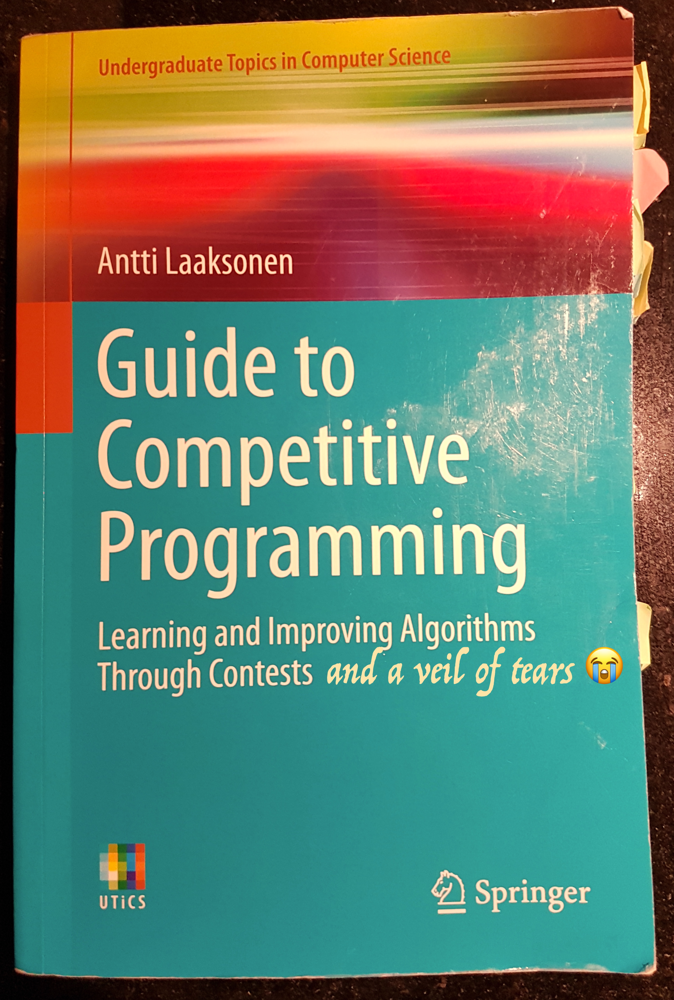

> The limit of language is the limit of one's world.
>
> > Ludvig Wittgenstein

### The card trick problem

Today's challenge is card magic :spades::hearts::diamonds: :clubs:!

This [Card Trick](https://open.kattis.com/problems/cardtrick2) allows any amateur illusionist to put the cards in such a way, that the right values appears in front of the eyes of the unbeliever:

1. move one card at the bottom of the deque, and the next is one! :clap:
2. Discard the one, move the next two cards one at a time at the bottom of the deque, and the next card you turn is two! :clap: :clap:
3. Discard two, and again, move three cards one at a time at the bottom of the deque, and the next is -unbelievably!- three! :clap: :clap: :clap:
4. and so on and so on, in front of your enraptured public.

Not enough with all the magic, but the amateur illusionist can also write a program that will allow her to arrange her card to be able to act so magically anytime she wants with how many cards she whishes!

My friend and I sat a long while to get how this was implemented. We cutted out little pieces of paper representing the cards and tried to understand in which order we should put them to make the magic happen. After a while, our coach (who probably does not want his illustre name sullied in such an amateurish publication) took pity on us and told us ~~the solution~~ a huge hint.

The hint was: **reverse the order by putting the last card first.**

To which we replied: thank you, we'll go home now.

### The solution

After a few days, I realized that not only the hint was actually the solution, but that the implementation was given in the problem. We needed a **deque**! Fortunately, most (?) programming languages have (maybe) a data structure called deque (no, really, I have no idea. But Python and C++ have.).

So what is so special about a deque? It's like an array, but we can put values at the front and the back.

The key is to reproduce those steps, but in reverse order. The problem gives us only one input, the biggest card.

1. so we need to place the biggest card on the top of the deque -let's say it's a 5 :clubs:-, popping it out from the bottom of the deque (I know, it's the same card), put it at the top of the deque (I know, why?), putting it at the top of the deque (yes it's weird!)... five times
2. take the next card, which is 4 :clubs:, put it at the top of the deque, pop the five from the bottom of the deque (now we have at least two cards so we look less unhinged), put the five at the top of the deque, ... four times.
3. take the 3 :clubs:, and repeat the procedure which looks less crazy now that you have three cards, three times.
4. ... when we reach the one, we have a perfectly organized deque to do this magic!

### Code

A few days ago, I read that quote from Wittgenstein in the Pragmatic Programmer, so I decided to rewrite the code in c++. Here it is!

```cpp
#include <iostream>
#include <deque>

using namespace std;

int main() {
    int testCases;
    cin >> testCases;

    for (int i = 0; i < testCases; ++i) {
        int biggestCard;
        cin >> biggestCard;
        deque<int> cardDeque;
        //remember, first the biggest card...
        for (int i = biggestCard; i > 0; i--) {
            cardDeque.push_front(i);
            //doing the crazy described at 1. here:
            for (int j = 0; j < i; j++) {
                int card_to_move = cardDeque.back();
                cardDeque.pop_back();
                cardDeque.push_front(card_to_move);
            }
        }
        //producing the perfect deque:
        while (not cardDeque.empty()) {
            cout << cardDeque.front() << " ";
            cardDeque.pop_front();
        }
    }
    return 0;
}
```

### Time complexity

Is this a Big-noh-noh solution? I did not know, so I checked what my _much loved_ and _much misunderstood_ Guide to competitive programming had to say:


also known as:



Well, what does it say? Here, page 54:

> The operations of a deque also work in _O(1)_ average time. However, deques have larger constant factors than vectors, so deques should be used only if ther is a need to manipulate both ends.

My analysis: I guess it's ok. I wish I knew what a constant factor was though.
